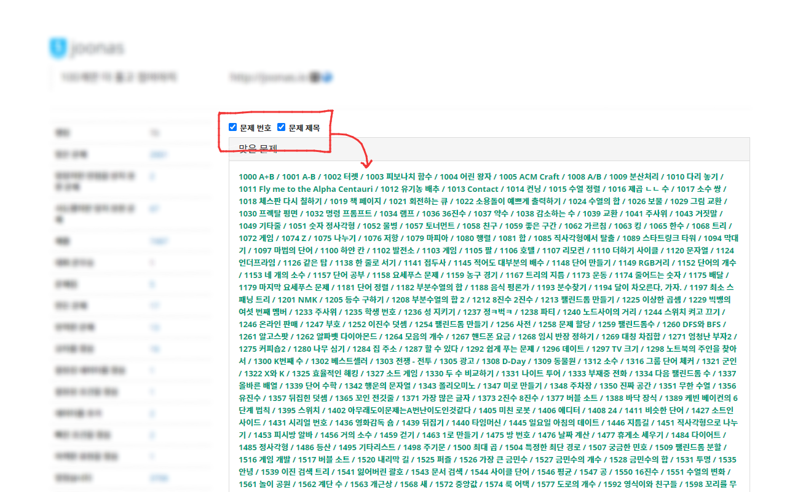
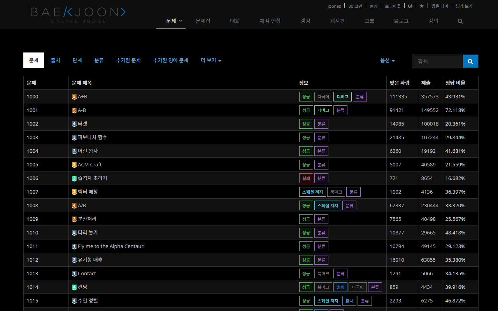
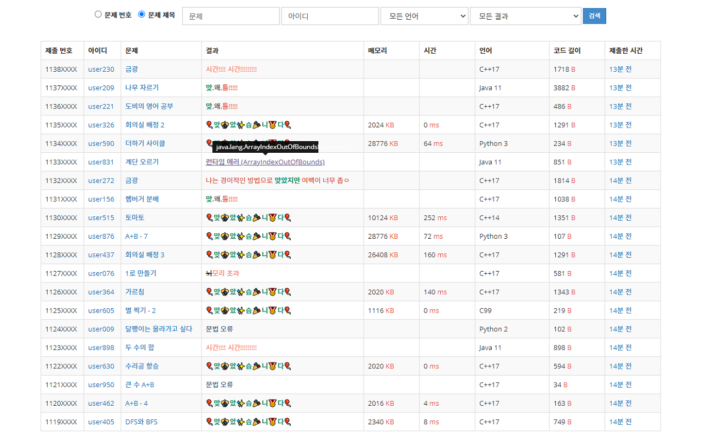
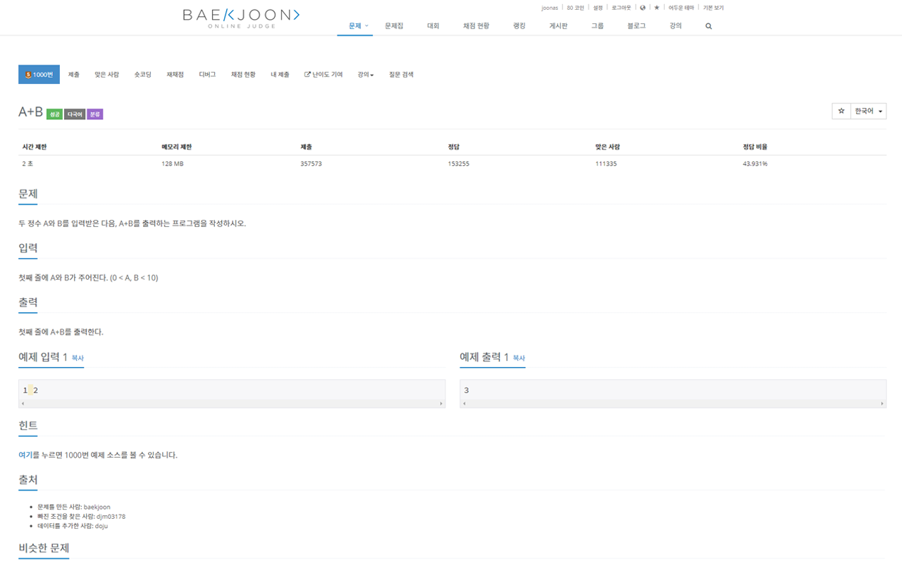
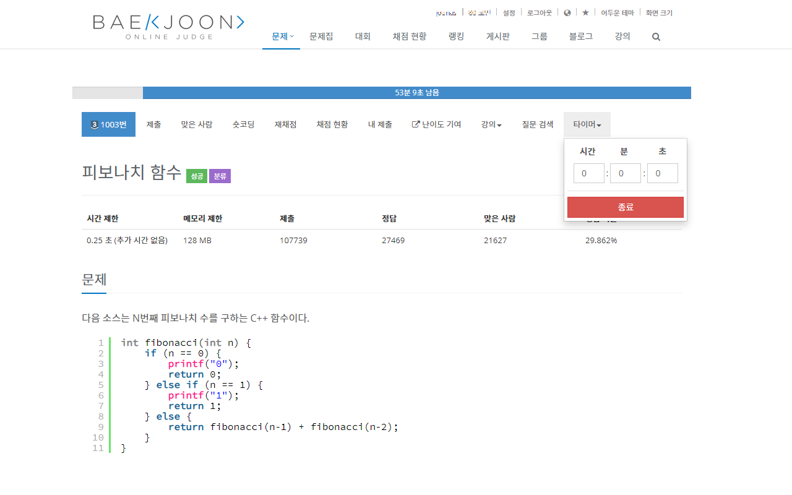
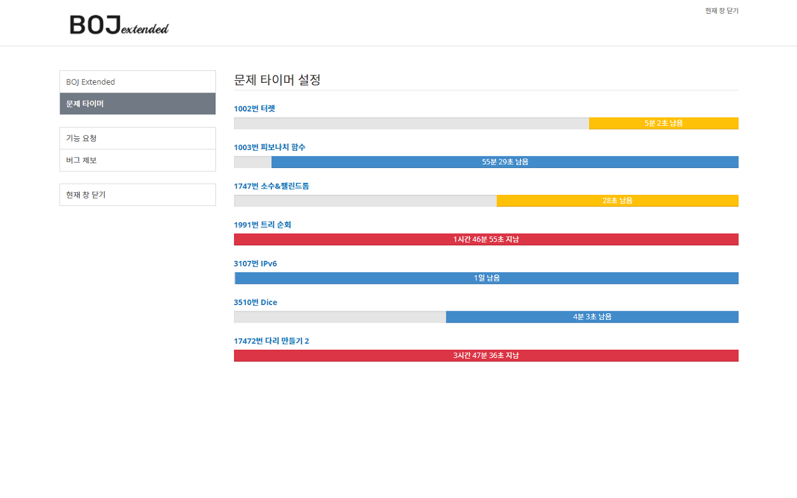
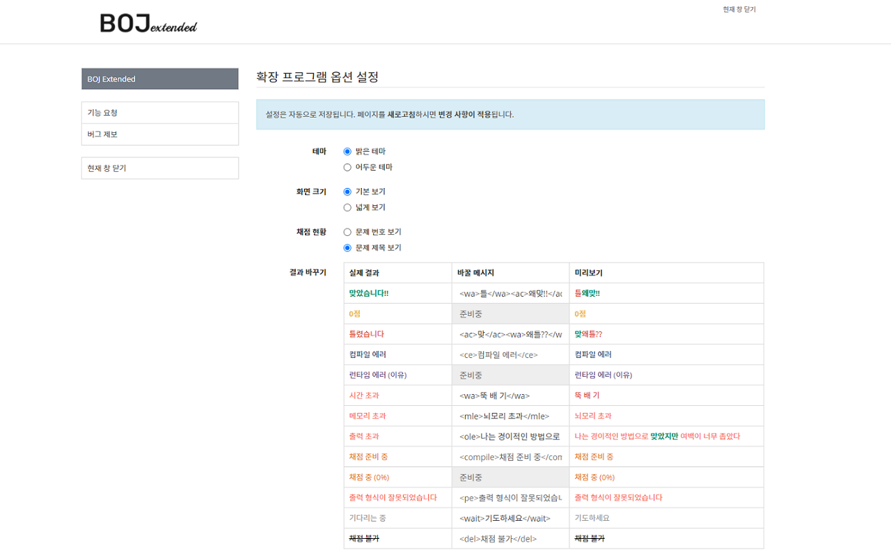
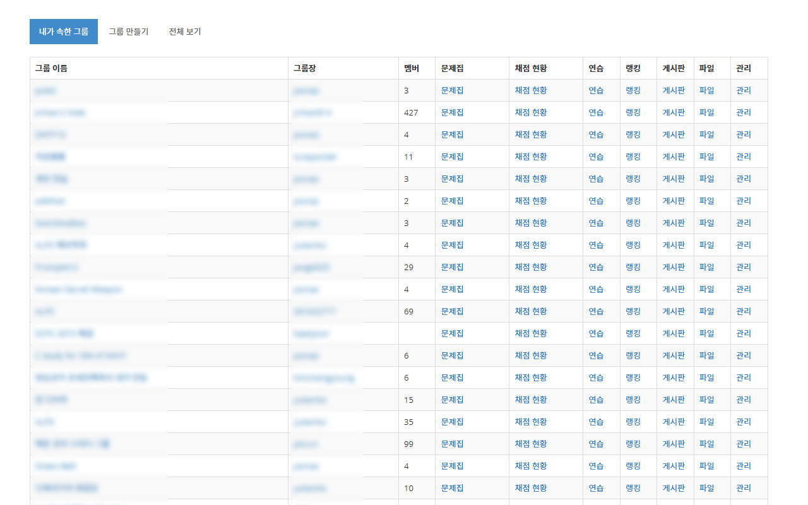
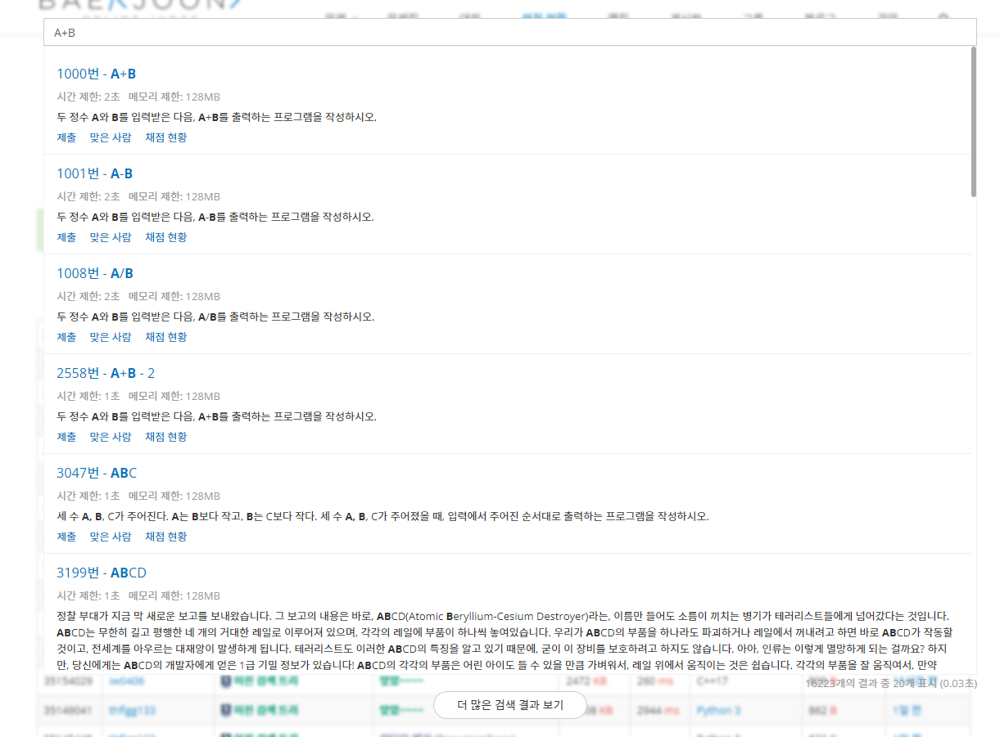
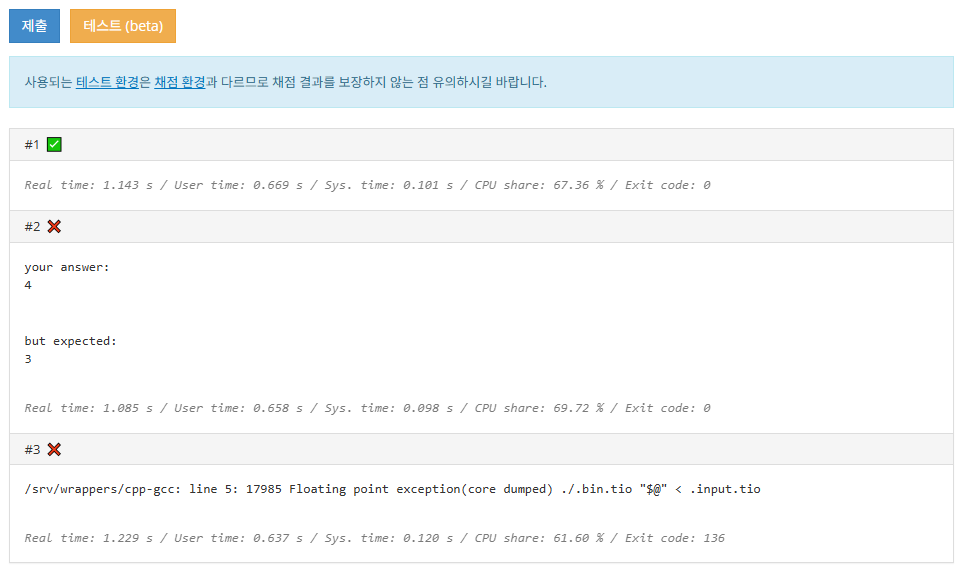

# BOJ-extended 

      
    

  

## 미리 보기

|                    **유저 페이지**                     |                      **어두운 테마**                      |
| :----------------------------------------------------: | :-------------------------------------------------------: |
|   [][1]   | [][2] |
|                     **채점 현황**                      |                       **넓게 보기**                       |
| [][3] |   [][4]    |
|                    **문제 타이머**                     |                      **문제 타이머**                      |
|    [][5]    |   [][6]    |
|                        **설정**                        |                     **유저 비교(VS)**                     |
|   [][7]    |    [][8]    |
|                        **그룹**                        |                       **빠른 검색**                       |
| [][9]  | [][10]  |
|                    **예제 테스트**                     |                                                           |
|   [][11]   |                                                           |

## 설치 및 사용

Google Chrome의 경우, 웹 스토어에서 최신 버전을 설치할 수 있습니다.

직접 설치하는 경우에는 브라우저마다 다르니, 각 브라우저의 설정에서 확인하시길 바랍니다.

<ul>
   <li>
      

         
<strong>직접 설치하기 (Chrome)</strong>

         <ul>
            <li><a href="https://www.howtogeek.com/120743/how-to-install-extensions-from-outside-the-chrome-web-store" target="_blank">How to Install Extensions From Outside the Chrome Web Store</a></li>
         </ul>
      

   </li>
   <li>
      

         
<strong>직접 설치하기 (Safari)</strong>

         <ol>
            <li>
               '개발자용' 메뉴에서 '서명되지 않은 확장프로그램 허용' 옵션 체크 
               (개발자용 메뉴 활성화: 환경설정 - 고급 - 메뉴 막대에서 개발자용 메뉴 보기)
            </li>
            <li>
               (NOTE) Safari의 정책으로 1.5.3 버전까지만 지원됩니다.  
               <a href="https://github.com/joonas-yoon/boj-extended/releases/download/v1.5.8/boj-extended-for-safari-1.5.3.dmg" target="_blank">dmg 파일</a>을 다운 받아 실행 후 boj extension을 애플리케이션 폴더로 복사 및 실행 
               (애플리케이션 폴더 내부로 복사한 파일을 실행해야 합니다.)
            </li>
            <li>
               사파리 확장프로그램 설정에 추가된 BOJ extension 체크
            </li>
            <li>
               <a href="https://www.acmicpc.net" target="_blank">백준 온라인 저지 사이트</a>에 접속 후 주소창 왼쪽에 나타난 BOJ extension 클릭 후 
               <i>'이 웹페이지에서 항상 허용'</i> 선택
            </li>
         </ol>
      

   </li>
   <li>
      

         
<strong>FireFox 공지사항</strong>

         <ul>
            <li><a href="https://github.com/joonas-yoon/boj-extended/issues/136">이슈#136</a> 스레드를 참고해주시길 바랍니다.</li>
         </ul>
      

   </li>
</ul>

## 업데이트 내역

[▶ 자세히 보기](UPDATENOTE.md)

## Contribute

Issue와 Pull Request는 언제나 환영합니다!

Pull request를 작성하실 예정이라면, [기여 가이드라인](CONTRIBUTING.md) 문서를 확인해주세요!

## License

[BOJ-extended](https://github.com/joonas-yoon/boj-extended/) are released under [MIT license](https://github.com/joonas-yoon/boj-extended/blob/master/LICENSE).

[1]: https://raw.githubusercontent.com/joonas-yoon/boj-extended/main/docs/images/screenshot-user.png
[2]: https://raw.githubusercontent.com/joonas-yoon/boj-extended/main/docs/images/screenshot-theme-dark.png
[3]: https://raw.githubusercontent.com/joonas-yoon/boj-extended/main/docs/images/screenshot-status.png
[4]: https://raw.githubusercontent.com/joonas-yoon/boj-extended/main/docs/images/screenshot-wide.png
[5]: https://raw.githubusercontent.com/joonas-yoon/boj-extended/main/docs/images/screenshot-timer2.png
[6]: https://raw.githubusercontent.com/joonas-yoon/boj-extended/main/docs/images/screenshot-timer.png
[7]: https://raw.githubusercontent.com/joonas-yoon/boj-extended/main/docs/images/screenshot-option.png
[8]: https://raw.githubusercontent.com/joonas-yoon/boj-extended/main/docs/images/screenshot-vs.png
[9]: https://raw.githubusercontent.com/joonas-yoon/boj-extended/main/docs/images/screenshot-group-list.png
[10]: https://raw.githubusercontent.com/joonas-yoon/boj-extended/main/docs/images/screenshot-search.png
[11]: https://raw.githubusercontent.com/joonas-yoon/boj-extended/main/docs/images/screenshot-test.png
