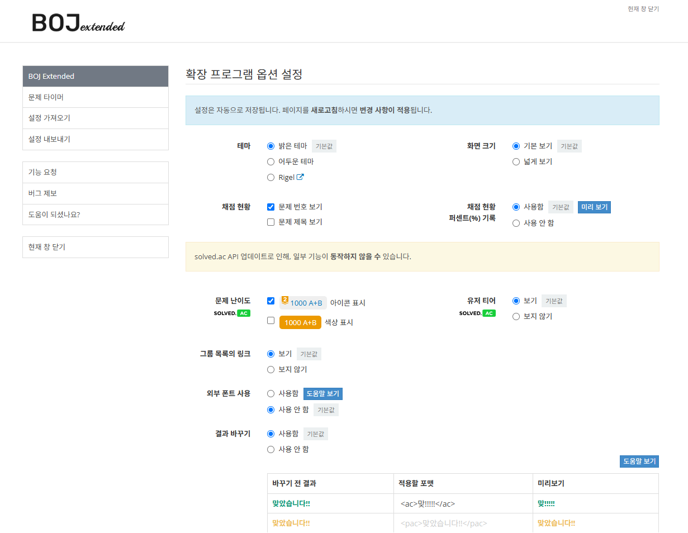

# BOJ-extended 

[](https://github.com/joonas-yoon/boj-extended/actions/workflows/build.yml)  [](https://chrome.google.com/webstore/detail/boj-%ED%94%84%EB%A1%9C%ED%95%84-%EB%AC%B8%EC%A0%9C-%EB%B3%B4%EA%B8%B0/mfcaadoifdifdnigjmfbekjbhehibfel)   
   

[](https://chrome.google.com/webstore/detail/boj-%ED%94%84%EB%A1%9C%ED%95%84-%EB%AC%B8%EC%A0%9C-%EB%B3%B4%EA%B8%B0/mfcaadoifdifdnigjmfbekjbhehibfel) [](https://store.whale.naver.com/detail/epdpeloboklojnaelckeihkghcgebhnp) [](https://addons.mozilla.org/ko/firefox/addon/boj-extended/)


## 미리 보기

|                    **유저 페이지**                     |                      **어두운 테마**                      |
| :----------------------------------------------------: | :-------------------------------------------------------: |
|   [][1]   | [][2] |
|                     **채점 현황**                      |                       **넓게 보기**                       |
| [][3] |   [][4]    |
|                    **문제 타이머**                     |                      **문제 타이머**                      |
|    [][5]    |   [][6]    |
|                        **설정**                        |                        **유저 VS**                        |
|   [][7]    |         [][8]         |
|                        **그룹**                        |                       **빠른 검색**                       |
| [][9]  | [][10]  |

## 설치 및 사용

Google Chrome과 Naver Whale의 경우, 웹 스토어에서 최신 버전을 설치할 수 있습니다.

직접 설치하는 경우에는 브라우저마다 다르니, 각 브라우저의 설정에서 확인하시길 바랍니다.

**Chrome에서 직접 설치하기**

- [How to Install Extensions From Outside the Chrome Web Store](https://www.howtogeek.com/120743/how-to-install-extensions-from-outside-the-chrome-web-store/)

**Safari에서 직접 설치하기**

1. '개발자용' 메뉴에서 '서명되지 않은 확장프로그램 허용' 옵션 체크
   (개발자용 메뉴 활성화: 환경설정 - 고급 - 메뉴 막대에서 개발자용 메뉴 보기)
2. extension.dmg 파일을 다운 받아 실행 후 boj extension을 애플리케이션 폴더로 복사 및 실행
   (애플리케이션 폴더 내부로 복사한 파일을 실행해야 합니다.)
3. 사파리 확장프로그램 설정에 추가된 BOJ extension 체크
4. [백준 온라인 저지 사이트](https://www.acmicpc.net)에 접속 후 주소창 왼쪽에 나타난 BOJ extension 클릭 후 '이 웹페이지에서 항상 허용' 선택

## 업데이트 내역

[▶ 자세히 보기](UPDATENOTE.md)

## 직접 수정 및 빌드

### Requirement

`npm`을 위해서 `node.js`가 필요합니다.

```bash
npm install
```

### Build

> Windows OS의 경우, [Git Bash](https://git-scm.com/downloads) 환경에서 실행하는 것을 권장합니다.

```bash
npm run build
```

위 커맨드를 입력하면, 빌드된 결과가 `dist/` 에 생성됩니다.

Chrome에 "확장 프로그램 - 개발자 모드 - `압축해제된 확장 프로그램을 로드합니다.`"를 클릭한 후, `dist/` 폴더를 지정하여 로드할 수 있습니다.

> `dist/` 디렉토리는 자동으로 빌드되므로 `push` 하실 필요가 없습니다.

### Lint

다음 커맨드로 코딩 컨벤션을 맞출 수 있습니다.

> `push` 전에 이 커맨드를 실행하는 것을 권장하지만, Pull Request의 경우 Github에서 자동으로 진행합니다.

```bash
npm run lint
```

## Directory Structure

크롬 확장 프로그램을 위한 파일 구조는 아래와 같습니다.

```bash
📁
├── 📁css       # css
├── 📁icons     # icons
├── 📁js        # javascript files
├── 📁options   # for option page
├── db.json
├── manifest.json
```

실제 배포되는 파일의 구조 (`dist/`)도 위와 같습니다.

## Contribute

Issue와 Pull Request는 언제나 환영합니다.

## License

[BOJ-extended](https://github.com/joonas-yoon/boj-extended/) are released under [MIT license](https://github.com/joonas-yoon/boj-extended/blob/master/LICENSE).

[1]: https://raw.githubusercontent.com/joonas-yoon/boj-extended/main/docs/images/screenshot-user.png
[2]: https://raw.githubusercontent.com/joonas-yoon/boj-extended/main/docs/images/screenshot-theme-dark.png
[3]: https://raw.githubusercontent.com/joonas-yoon/boj-extended/main/docs/images/screenshot-status.png
[4]: https://raw.githubusercontent.com/joonas-yoon/boj-extended/main/docs/images/screenshot-wide.png
[5]: https://raw.githubusercontent.com/joonas-yoon/boj-extended/main/docs/images/screenshot-timer2.png
[6]: https://raw.githubusercontent.com/joonas-yoon/boj-extended/main/docs/images/screenshot-timer.png
[7]: https://raw.githubusercontent.com/joonas-yoon/boj-extended/main/docs/images/screenshot-option.png
[8]: https://raw.githubusercontent.com/joonas-yoon/boj-extended/main/docs/images/screenshot-vs.png
[9]: https://raw.githubusercontent.com/joonas-yoon/boj-extended/main/docs/images/screenshot-group-list.png
[10]: https://raw.githubusercontent.com/joonas-yoon/boj-extended/main/docs/images/screenshot-search.png
